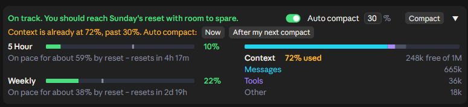
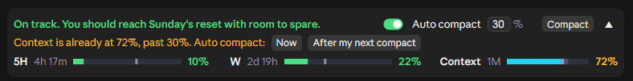

# Claude Code Usage Quota Mod with Auto Compact

[](https://github.com/anantraghunath/claude-code-usage-quota-mod/releases/latest)      

**Know your Claude limits before they hit you.** A live band above the Claude Code prompt that shows your plan limits, forecasts whether you'll run out before they reset, and shows how full your context window is. **Compact in one click, or let it compact automatically.**

The 5 Hour and Weekly limits are **your whole Claude account's**, including what you use in Claude chat and Cowork. The band itself shows in **Claude Code**: the desktop app and the terminal.

**Live from the moment a session opens.** Many usage mods stay blank until Claude replies, because they only read the figures each reply carries. This one asks Anthropic's usage service straight away, for free (it uses no tokens and doesn't count toward your limits), so your limits are there as soon as the band appears, and it keeps them current every few seconds while you work.

Type **`/quota`** to turn the band off and on.

## EXPANDED


## COLLAPSED

One row that still shows the time left until each limit resets:


> [!TIP]
> **Never hit a full context again: Auto compact, on by one click.**
> With Auto compact on, the band compacts your session once the context reaches **30%** (the default; set **15 to 99**). A long context costs more on every reply, so compacting early keeps replies **cheaper** and your limits **lasting longer**. Auto compact never interrupts a reply. Want to compact right now? The **Compact** button runs `/compact` in one click.
>
> **Each session keeps its own Auto compact setting**, even after a restart, so you can run them differently side by side:
> - **Building something big?** Set Auto compact higher (say 70%) or turn it off, so Claude keeps the whole picture. Press **Compact** yourself at a good stopping point. (With it off, Claude Code's built-in compaction still steps in when the context is nearly full.)
> - **Everyday sessions?** One click turns Auto compact on at 30%. They stay lean, and your 5 Hour and Weekly limits last longer.

## WHAT IT SHOWS

**5 Hour and Weekly limits**
- The **% used**, matching the app's own *Plan usage limits* panel.
- A **forecast** of where you'll be at reset: a grey tick on the bar and a note, e.g. *On pace for about 87% by reset – resets in 23m*.
- A **headline** at a glance: *On track. You should reach Wednesday's reset with room to spare.*
- The forecast starts from **your usual pace** (learned from your past windows) and shifts to your actual pace as the window goes on, so an early burst doesn't set it off.
- Bars turn **amber at 75%** and **red at 90%**, or sooner if you're on course to run out.

On course to run out, it warns you and says **when you'll hit the limit**:


**Context window**
- The % used and space free, as `/context` counts it, split into Messages, Tools and Other.
- **Amber at 50%**, **red at 80%**: the point to compact.

**Compacting**
- **Compact** runs `/compact` in one click.
- **Auto compact** runs at your % (30% by default, 15 to 99), never mid-reply. Each session keeps its own setting; a new session starts with it off.

If the session is already past your % when you turn it on, it asks first:





- **Now** compacts straight away.
- **After my next compact** waits until the session is compacted some other way (Compact, `/compact`, or Claude Code's own), then takes over.

Works in **light and dark** themes and at **every width** down to the narrowest. Collapsed or expanded is shared across all sessions.

> [!NOTE]
> **MORE SCREENSHOTS**
>
> Early in a 5 hour window:
>
> 
>
> 
>
> Running out on the Weekly limit:
>
> 
>
> 
>
> | Light theme | Narrowest window |
> | --- | --- |
> |  |  |
> |  |  |

## WHERE IT WORKS

- **Claude desktop app**, Code tab
- **Claude Code in a terminal**

> [!NOTE]
> In the desktop app, the band appears once a session has started. The brand-new *Welcome back* screen has no session yet, so no mod can draw there. Send your first message and it appears.

In the terminal, **▲/▼** expands and collapses it. The `[-]` next to it is Claude Code's own control and hides the band; **ctrl+x ctrl+a** brings it back.


Collapsed:


## INSTALL

Needs **Claude Code 2.1.287 or later**, signed in with a **Pro or Max** plan.

**Desktop app:** in the **Code** tab, send this as a message, allow the `claude plugin` commands if asked, then **quit and reopen** the app:

```text
Install the usage-quota plugin from the GitHub marketplace anantraghunath/claude-code-usage-quota-mod
```

**Terminal:** inside `claude`, run these one at a time:

```text
/plugin marketplace add anantraghunath/claude-code-usage-quota-mod
```

```text
/plugin install usage-quota@claude-code-usage-quota-mod
```

```text
/reload-plugins
```

The band appears once the plugins reload. If it doesn't, restart Claude Code.

Either way installs it for **both** the desktop app and the terminal.

> [!IMPORTANT]
> **Installed before v0.1.5?** The plugin was renamed from `claude-code-usage-quota` to **`usage-quota`**, because Claude Code reserves names starting with `claude-` for Anthropic's own plugins. Updating won't pick up the new name, so remove the old one and install again. This gets you the latest version, **v0.1.6**.
>
> **Desktop app:** in the **Code** tab, send this as a message:
>
> ```text
> Run these one at a time: claude plugin uninstall claude-code-usage-quota@claude-code-usage-quota-mod, then claude plugin marketplace update claude-code-usage-quota-mod, then claude plugin install usage-quota@claude-code-usage-quota-mod
> ```
>
> **Terminal:** run these in your shell:
>
> ```bash
> claude plugin uninstall claude-code-usage-quota@claude-code-usage-quota-mod
> ```
>
> ```bash
> claude plugin marketplace update claude-code-usage-quota-mod
> ```
>
> ```bash
> claude plugin install usage-quota@claude-code-usage-quota-mod
> ```
>
> Then restart. Your Auto compact settings and learned pace carry over.

**Update:** ask Claude, then restart:

```text
Update the usage-quota plugin from its marketplace
```

**Uninstall:** in the desktop app, ask Claude:

```text
Remove the claude-code-usage-quota-mod plugin marketplace
```

or in the terminal:

```text
/plugin marketplace remove claude-code-usage-quota-mod
```

then restart. This removes it from both. Just want it out of sight? **`/quota`** hides it without uninstalling.

<details>
<summary>From your own shell instead</summary>

```bash
claude plugin marketplace add anantraghunath/claude-code-usage-quota-mod; claude plugin install usage-quota@claude-code-usage-quota-mod
```

To update:

```bash
claude plugin marketplace update claude-code-usage-quota-mod; claude plugin update usage-quota@claude-code-usage-quota-mod
```

To uninstall:

```bash
claude plugin marketplace remove claude-code-usage-quota-mod
```

</details>

## PRIVACY

**Everything runs on your machine**, with the same access Claude Code has, like any mod, so read the code before installing any mod you don't trust. It **never sees your credentials** and sends nothing anywhere except the one request below.

<details>
<summary>Exactly what it reads, sends and runs</summary>

- **Network:** about every 2 minutes, one request to `https://api.anthropic.com/api/oauth/usage`, Anthropic's usage service, for your 5 Hour and Weekly limits. It goes through your existing Claude login: Claude Code attaches the credential, and the mod never sees it. That is the only host it contacts. The `www.w3.org` address in the code is only the namespace of the drawn bars' SVG images; nothing is sent there.
- **Your session:** it reads the context size and the limits each reply carries, as Claude Code reports them. It doesn't read or send what you or Claude write.
- **Commands:** it runs `/compact` when you press **Compact**, or when Auto compact reaches your %. It adds `/quota`, which turns the band off and on.
- **Programs:** only to match your system's light or dark mode, when the desktop app follows the system: `reg query` for `AppsUseLightTheme` on Windows, `defaults read -g AppleInterfaceStyle` on macOS.
- **Files:** it reads the desktop app's `config.json` for its theme setting. Once, after the v0.1.5 rename, it copies the old plugin's saved settings from `~/.claude/plugins/store`.
- **Hooks:** the band's own clicks and focus (`ui.press`, `ui.focus`) and edits to the prompt (`prompt.edit`) only set a % you typed in the band, then pass on unchanged. Turns starting and ending tell it when a reply is running, so Auto compact never interrupts one.

</details>

## FEEDBACK AND CONTRIBUTING

First release: I'd love to hear how it works for you. [Open an issue](https://github.com/anantraghunath/claude-code-usage-quota-mod/issues) for bugs or ideas. Pull requests welcome.

To work on it, clone the repo, then load it from the folder, or run its tests:

```bash
claude --plugin-dir ./claude-code-usage-quota-mod
```

```bash
claude plugin test ./claude-code-usage-quota-mod
```

**If you find it useful, a ⭐ helps others find it.**

## CREDITS

Inspired by [I'm liking the new mods feature](https://www.reddit.com/r/ClaudeCode/comments/1wwjman/im_liking_the_new_mods_feature/) on r/ClaudeCode. Thanks to [u/itsxzy](https://www.reddit.com/user/itsxzy/) for sharing the original prompt that started this project.

## LICENSE

[MIT](LICENSE) © 2026 Anant Raghunath
